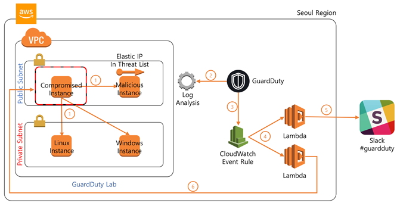

# AWS Guardduty Introuduction

by @mosesyoon at awskrug.slack.com

## Index

* [Preparation](#preparation)
* [Slack](#slack)
* [Party](#party)
* [Cleanup](#cleanup)
* [More?](#more)

# Introduction

* AWS GuardDuty?
  - 트래픽/성능에 영향을 주지 않는다!(VPC 흐름 로그, DNS 로그, CloudTrail 이벤트 사용)
  - 정말 손쉽게 통합 가능
  - 프로그래밍적으로 다양하게 커스터마이징 가능
  - 네트워크 이슈 이외의 AWS 내의 계정 부정 사용 등의 경우도 검출!(한다고 한다)
  
# Preparation



위에 그림에서 화살표 6 번은 즉 공격 확인 후 선차단 조치 등을 할 수도 있다는 것이나, 본 실습에서는 제외합니다. [More](#more)의 내용을 살펴보시면, 매우 쉽게 구성하실 수 있습니다.

> 현재, 서울 리전에 문제인지, `lambda` 를 제대로 지원이 안되는 증상(node8.10 런타임에는 CFN으로는 .zip 파일로 올리지 못하는?!)이 있으므로 싱가폴(ap-southeast-1)을 사용하기로 합니다.

## GuardDuty Lab 구성

  - `EC2` 에서 [Key Pairs](https://console.aws.amazon.com/ec2/v2/home?#KeyPairs)에서 `Create Key Pair`를 통해 키쌍의 이름은 `gangnam`으로 정하고 다운로드 받습니다.

  - [Demo CFN template](https://raw.githubusercontent.com/awslabs/amazon-guardduty-tester/master/guardduty-tester.template) 이 파일을 다운로드 받고, `guardduty-tester.template` 로 저장합니다.

  - [Cloudformation Console](https://console.aws.amazon.com/cloudformation/home) 에서 `Create Stack`을 클릭합니다.

  - Select Template
    - `Choose a template` 에서 `Upload a template to Amazon S3`를 체크 후 방금 다운로드 받은 `guardduty-tester.template` 을 선택하고, `Next`를 합니다.

  - Specify Details
    - `Stack Name` 은 `gangnam-GuardDutyTest`로
    - `Availability Zones`을 `ap-northeast-2a` 로 선택
    - `Key Pair Name` 은 `gangnam` 
    - `Allowed Bastion External Access CIDR` 는 그냥 `0.0.0.0/0` 으로 둡니다.
    - `Next` 합니다.

  - Options
    - `Next` 합니다.

  - Review
    - `I acknowledge that AWS CloudFormation might create IAM resources.`에 체크 하시고
    - `Create` 합니다.

  - `CREATE_IN_PROGRESS` 로 바뀌며 10분 후 정도면, 데모를 운영해 볼 수 있는 구성이 준비됩니다.

## Slack 구성

  - 슬랙 준비
    - 슬랙은 별도로 다운 안 받고 브라우저로만 해도 됩니다.
        혹, 슬랙에 가입이 안되어 있으시다면, 슬랙에 가입하시고,
        [AWSKRUG 초청](http://slack.awskr.org)에 가셔서 이메일을 등록하시면 초청 메일 통해서 [AWSKRUG slack](https://awskrug.slack.com)으로 들어오실 수 있습니다.

    - 슬랙 웹 훅 주소 알아야 합니다.
        브라우저로 `AWSKRUG slack`으로 로그인한 다음에 [Slack web hook](https://my.slack.com/services/new/incoming-webhook/) 열어 봅니다.

        - `Add Configuration` 버튼을 클릭합니다.
        - `Post to Channel` 에서 `#guardduty` 를 선택합니다.
        - 그러면 하단에 `Add Incoming WebHooks integration` 이 표시되고, 이 버튼을 클릭하면, `Webhook URL`이 표시됩니다.
        - 요 `Webhook URL` 값을 복사해 둡니다.

  - 슬랙 연결 [CFN template](https://raw.githubusercontent.com/aws-samples/amazon-guardduty-to-slack/master/gd2slack.template) 파일을 다운로드 받고, `gd2slack.template` 으로 저장합니다.

  - [Cloudformation Console](https://console.aws.amazon.com/cloudformation/home) 에서 `Create Stack`을 클릭합니다.

  - Select Template
    - `Choose a template` 에서 `Upload a template to Amazon S3`를 체크 후 방금 다운로드 받은 `gd2slack.template` 을 선택하고, `Next`를 합니다.

  - Specify Details
    - `Stack Name` 은 `gangnam-GuardDutyNotifier`로
    - `Slack Incoming Web Hook URL` 은 방금 복사했던, `Webhook URL`을 입력합니다.
    - `Slack channel to send findings to` 는 `#guardduty`이겠지요?
    - `Minimum severity level (LOW, MED, HIGH)` 은 그냥 `LOW` 로 둡니다.
    - `Next` 합니다.

  - Options
    - `Next` 합니다.

  - Review
    - `I acknowledge that AWS CloudFormation might create IAM resources.`에 체크 하시고
    - `Create` 합니다.

  - `CREATE_IN_PROGRESS` 로 바뀌며 2분 후 정도면, 위협이 발생할 떄마다 슬랙에 메시지를 보내줍니다.
    
# Party

* 둘다 `CREATE_COMPLETE`이 될 떄까지 기다립니다.

* [GuardDuty Console](https://console.aws.amazon.com/guardduty/home)에서 `Get Started` 클릭 후 `Enable GuardDury` 를 클릭합니다.

  혹은 CLI 로도 가능합니다.
  ```bash
  aws guardduty create-detector
  {  
     "detectorId":"0cb28c226a8658f5357cf0ff794a22f5"
  }
  ```

* 이제 공격자가 되어 Bastion(`Malicious Instance`)에 접속해서, `Compromised Instance` 으로 접속 후에 `./guardduty-tester1.sh` 을 실행해볼까요?
  
  접속 서버 정보는 [Cloudformation Console](https://console.aws.amazon.com/cloudformation/home)에서 `GuardDuty Lab 구성` 곧 ` gangnam-GuardDutyTest` 의 `Output` 값을 보면 알 수 있습니다.

  Key       |Value        |Description
  :-        |:-           |:-
  RedTeamIp |172.16.0.27  |Local IP for RedTeam Instance 	
  BastionIp |54.180.17.245|Elastic IP for Bastion

  접속은 아래를 참조해서 합시다.
  - Putty 는 https://docs.aws.amazon.com/ko_kr/AWSEC2/latest/UserGuide/putty.html
  - Mac/Linux 는 https://docs.aws.amazon.com/ko_kr/AWSEC2/latest/UserGuide/AccessingInstancesLinux.html

* 접속 준비를 끝났어도, 로그는 안 쌓여 있을 수 있다. 10분 정도는 기다리자.

* 이렇게 10 분정도 지나면, [Free trial](https://console.aws.amazon.com/guardduty/?#/free-trial)에서 대략 처리한 로그량을 알 수 있다.

  종류            |용량
  :-              |:-
  CloudTrail logs |9.3 k events
  VPC Flow logs   |3.47 MB
  DNS logs        |2.96 MB


* 이런식으로 되었다면, [Guardduty Console](https://console.aws.amazon.com/guardduty/home)에 들어가 보시면 혹은 `Slack` 으로 이미 여러 메시지가 와 있을 것입니다.

* 실제 데이터를 살펴 볼까요?
    ```json
    {
        "Resource": {
            "ResourceType": "Instance", 
            "InstanceDetails": {
                "ProductCodes": [], 
                "AvailabilityZone": "ap-southeast-1c", 
                "Tags": [], 
                "InstanceId": "i-01566173adc7471ae", 
                "InstanceState": "running", 
                "ImageDescription": "Amazon Linux 2 AMI 2.0.20180622.1 x86_64 HVM gp2", 
                "ImageId": "ami-05868579", 
                "LaunchTime": "2018-08-08T02:54:54Z", 
                "InstanceType": "t2.micro", 
                "NetworkInterfaces": [
                    {
                        "VpcId": "vpc-b2f78ed5", 
                        "PrivateIpAddresses": [
                            {
                                "PrivateDnsName": "ip-172-31-5-239.ap-southeast-1.compute.internal", 
                                "PrivateIpAddress": "172.31.5.239"
                            }
                        ], 
                        "NetworkInterfaceId": "eni-00517862bed01b666", 
                        "PublicDnsName": "ec2-13-250-231-26.ap-southeast-1.compute.amazonaws.com", 
                        "PublicIp": "13.250.231.26", 
                        "PrivateDnsName": "ip-172-31-5-239.ap-southeast-1.compute.internal", 
                        "SecurityGroups": [
                            {
                                "GroupName": "launch-wizard-1", 
                                "GroupId": "sg-09970c788c64e53a3"
                            }
                        ], 
                        "Ipv6Addresses": [], 
                        "SubnetId": "subnet-827c92db", 
                        "PrivateIpAddress": "172.31.5.239"
                    }
                ]
            }
        }, 
        "Description": "54.169.40.11 is performing SSH brute force attacks against i-01566173adc7471ae. Brute force attacks are used to gain unauthorized access to your instance by guessing the SSH password.", 
        "Service": {
            "Count": 1, 
            "Archived": true, 
            "ServiceName": "guardduty", 
            "EventFirstSeen": "2018-08-08T05:39:22Z", 
            "ResourceRole": "TARGET", 
            "EventLastSeen": "2018-08-08T05:49:22Z", 
            "DetectorId": "$detector_id", 
            "Action": {
                "ActionType": "NETWORK_CONNECTION", 
                "NetworkConnectionAction": {
                    "ConnectionDirection": "INBOUND", 
                    "Protocol": "TCP", 
                    "RemoteIpDetails": {
                        "GeoLocation": {
                            "Lat": 1.2931, 
                            "Lon": 103.8558
                        }, 
                        "City": {
                            "CityName": "Singapore"
                        }, 
                        "IpAddressV4": "54.169.40.11", 
                        "Organization": {
                            "Org": "Amazon", 
                            "Isp": "Amazon", 
                            "Asn": "16509", 
                            "AsnOrg": "Amazon.com, Inc."
                        }, 
                        "Country": {
                            "CountryName": "Singapore"
                        }
                    }, 
                    "RemotePortDetails": {
                        "PortName": "Unknown", 
                        "Port": 34764
                    }, 
                    "LocalPortDetails": {
                        "PortName": "SSH", 
                        "Port": 22
                    }, 
                    "Blocked": false
                }
            }
        }, 
        "Title": "54.169.40.11 is performing SSH brute force attacks against i-01566173adc7471ae. ", 
        "Type": "UnauthorizedAccess:EC2/SSHBruteForce", 
        "Region": "ap-southeast-1", 
        "Partition": "aws", 
        "Arn": "arn:aws:guardduty:ap-southeast-1:691767955026:detector/$detector_id/finding/aab28c0b70217e0cf7915738e79f4a7f", 
        "UpdatedAt": "2018-08-08T05:51:17.058Z", 
        "SchemaVersion": "2.0", 
        "Severity": 2, 
        "Id": "aab28c0b70217e0cf7915738e79f4a7f", 
        "CreatedAt": "2018-08-08T05:51:17.058Z", 
        "AccountId": "691767955026"
    }
    ```

* 수행하는 공격들은 어떤 것 들인가?
    1) [UnauthorizedAccess:EC2/SSHBruteForce](https://docs.aws.amazon.com/ko_kr/guardduty/latest/ug/guardduty_finding-types.html#unauthorized9)
    EC2 인스턴스가 SSH 무차별 암호 대입 공격에 관여했습니다.
    
    2) [UnauthorizedAccess:EC2/RDPBruteForce](https://docs.aws.amazon.com/ko_kr/guardduty/latest/ug/guardduty_finding-types.html#unauthorized10)
    EC2 인스턴스가 RDP 무차별 암호 대입 공격에 관여했습니다.
    
    3) [CryptoCurrency:EC2/BitcoinTool.B!DNS](https://docs.aws.amazon.com/ko_kr/guardduty/latest/ug/guardduty_finding-types.html#crypto3)
    EC2 인스턴스가 비트코인 관련 활동과 연결된 도메인 이름을 쿼리하는 중입니다.
    
    4) [Trojan:EC2/DNSDataExfiltration](https://docs.aws.amazon.com/ko_kr/guardduty/latest/ug/guardduty_finding-types.html#trojan10)
    EC2 인스턴스가 DNS 쿼리를 통해 데이터를 유출시키고 있습니다.

    5) [Recon:EC2/Portscan](https://docs.aws.amazon.com/ko_kr/guardduty/latest/ug/guardduty_finding-types.html#recon5)
    EC2 인스턴스가 원격 호스트에 대한 아웃바운드 포트 스캔을 수행하고 있습니다.

    6) [Backdoor:EC2/C&CActivity.B!DNS](https://docs.aws.amazon.com/ko_kr/guardduty/latest/ug/guardduty_finding-types.html#backdoor7)
    EC2 인스턴스가 알려진 명령 및 제어 서버와 연결된 도메인 이름을 쿼리하는 중입니다.

* `GuardDuty`도 머신러닝 기반이라, `Feedback` 을 성실하게 주면 결과도 잘 나올듯 하다(참고).

# Cleanup

  - [GuardDuty Console](https://console.aws.amazon.com/guardduty/home?#/settings)의 `Settings`에서 `Disable GuardDuty` 체크 후 `Save settings` 를 클릭. 주의 메시지가 나오면 `Disable` 클릭

  - [Cloudformation Console](https://console.aws.amazon.com/cloudformation/home)  로 갑니다.
  
    - `gangnam-GuardDutyTest`에 체크하시고, `Action` 버튼에서 `Delete Stack` 버튼 클릭

    - `gangnam-GuardDutyNotifier`에 체크하시고, `Action` 버튼에서 `Delete Stack` 버튼 클릭

  - `EC2` 의 [Key Pairs](https://console.aws.amazon.com/ec2/v2/home?#KeyPairs)에서 `gangnam` 를 체크하시고, `Delete` 버튼 클릭

  - `IAM` 의 `Roles` 에서 `AWSServiceRoleForAmazonGuardDuty` 체크 후 `Delete Role` 버튼 클릭

# More?

 Q. 적용 이전에 로그들도 분석하나?
 - 실험적으로 그렇지는 않다. 다만, 시작한 시점의 로그는 최대 90일간은 모두 분석하는 듯 하다? 답은 AWS에...

 Q. 멀티 계정은 어떻게?
 - https://github.com/aws-samples/amazon-guardduty-multiaccount-scripts

 Q. 너무 알람이 자주 와요? 
 - cloudwatch 에서 severity 를 조절하거나 filter 에서 archiving 하도록 처리하세요.

 Q. 알렉사(Alexa)를 이용한 조회도 가능한가요?
 - 당연히 가능합니다. 
   - 원문: https://github.com/aws-samples/amazon-guardduty-alexa-sample
   - 번역본: https://cloud.hosting.kr/techblog_180420_amazon_alexa_to_get_amazon_guardduty/

 Q. 초기 대응도 자동으로 하고 싶어요?
 - 서드 파티 솔루션도 많고, 보통 응용은 `CloudWatch Event`를 기반으로 하여, 차단할 수 있습니다. 아래를 참조하시면 되겠습니다.
    - 자동 차단(공격자 IP를 DynamoDB 에 저장하여 화이트 리스트 관리): https://github.com/aws-samples/amazon-guardduty-waf-acl
    - 자동 차단(심각도 8.0 이상이면 차단하는 예): https://github.com/dpigliavento/aws-support-tools/tree/master/GuardDuty
    - 자동 차단 & 관리: http://woowabros.github.io/security/2018/02/23/aws-auto-security1.html

 Q. 공격 당한 후에는 어떻게?
 - [Amazon EC2 모범 사례](https://docs.aws.amazon.com/ko_kr/AWSEC2/latest/UserGuide/ec2-best-practices.html)를 참고하세요.

 Q. 아직은 초기버전 아닌가요?
 - 여러 서드파티들을 대동해서...

 Q. 넘 느리지 않나요?
 - 오진(false positive) 보단 낫지 않을까 싶군요.

 Q. 추가 필터는 어떻게 공급받을까요?
 - 파트너 사에 물어봐야 할 듯. 답은 AWS에게...

 Q. 시각화는 어떻게?
 - 위치 정보도 있고, 시각화 할 수 있는 정보가 많으니 `ELK` 혹은 `QuickSight` 를 적절히 사용하시면 되겠습니다~